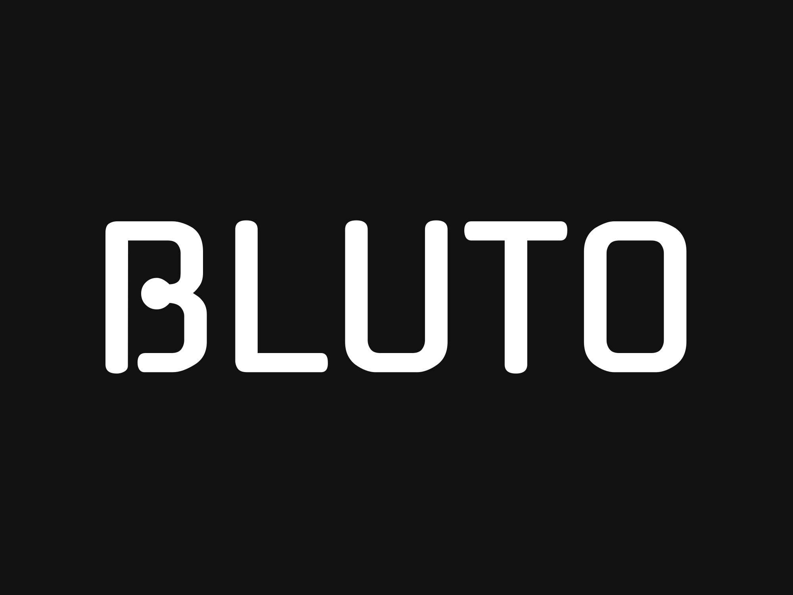

# 🧠 Blutto

**Blutto** is a modern, full-featured project and task management app — inspired by tools like Notion, Linear, and Trello. It helps individuals and teams collaborate, track tasks, and get work done efficiently with a clean UI and powerful features.

---

## 🚀 Features

- 🗂️ Workspace & Board Management
- 📋 Kanban-style Task Boards
- 📅 Calendar Integration
- 🔍 Advanced Filtering & Search
- 👥 Multi-user Support & Authentication
- 🎨 Beautiful and responsive UI (Dark mode included)
- 🔐 Role-based Access Control
- ⚙️ Settings & Profile Management
- 💾 Persistent data with Prisma + PostgreSQL

---

## 📸 Preview




---

## 🛠️ Tech Stack

| Layer        | Tech                        |
|--------------|-----------------------------|
| Frontend     | React, Next.js (App Router), Tailwind CSS, ShadCN/UI |
| Backend      | Next.js API Routes, Prisma, Zod |
| Auth         | NextAuth.js (Google, GitHub, Credentials) |
| Database     | PostgreSQL                  |
| Drag & Drop  | `@dnd-kit` for Kanban boards |
| Hosting      | Vercel                      |

---

## 🔧 Installation

```bash
# 1. Clone the repository
git clone https://github.com/yourusername/blutto.git
cd blutto

# 2. Install dependencies
npm install

# 3. Copy and configure environment variables
cp .env.example .env.local

# 4. Set up database
npx prisma migrate dev --name init

# 5. Run the app
npm run dev
